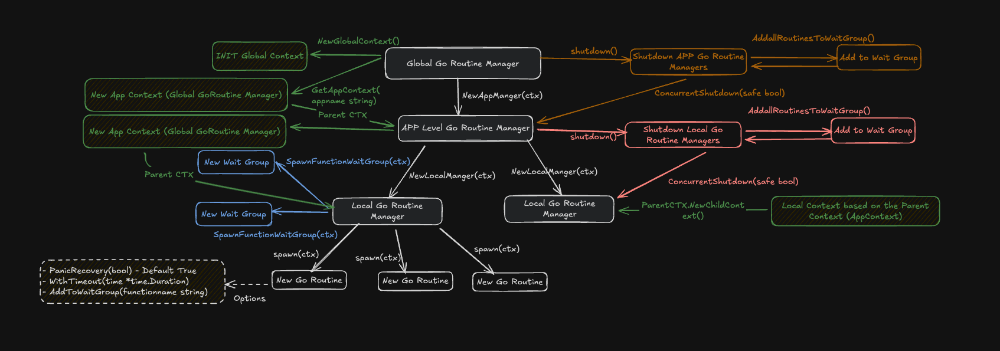
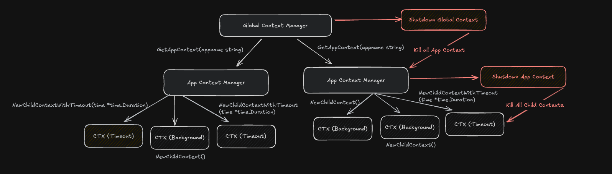

# GoRoutinesManager

A lightweight, hierarchical goroutine supervision system for Go that centralizes goroutine creation, lifecycle control, and shutdown handling. This library prevents goroutine leaks, improves observability, and enforces safe concurrency patterns in production applications.



---

## Table of Contents

- [Introduction](#introduction)
- [Pain Points with Raw Goroutines](#pain-points-with-raw-goroutines)
- [Why GoRoutinesManager?](#why-goroutinesmanager)
- [Architecture](#architecture)
  - [Manager Hierarchy](#manager-hierarchy)
  - [Context Architecture](#context-architecture)
  - [Data Flow](#data-flow)
  - [Thread Safety](#thread-safety)
- [Quick Start](#quick-start)
- [Features](#features)
- [Metrics &amp; Observability](#metrics--observability)
- [Best Practices](#best-practices)
- [API Reference](#api-reference)
- [Contributing](#contributing)
- [License](#license)

---

## Introduction

Go's goroutines are powerful for concurrent programming, but managing them at scale in production applications presents significant challenges. Without proper supervision, goroutines can leak, become orphaned, or fail silently, leading to resource exhaustion and unpredictable behavior.

**GoRoutinesManager** provides a structured, hierarchical approach to goroutine management that brings enterprise-grade supervision, observability, and lifecycle control to your Go applications.

---

## Pain Points with Raw Goroutines

When using raw goroutines without a management system, developers face several critical challenges:

### 1. **Goroutine Leaks**

**Problem:** Goroutines can leak when parent contexts are cancelled or when goroutines become blocked. Without tracking, there's no guarantee of cleanup, leading to memory leaks that accumulate over time and are difficult to detect in production.

**Issues:**

- No tracking of spawned goroutines
- No guarantee of cleanup on context cancellation
- Memory leaks accumulate over time
- Difficult to detect in production

### 2. **No Observability**

**Problem:** There's no visibility into goroutine lifecycle. You cannot track how many goroutines are active, monitor their health, or understand their execution patterns.

**Issues:**

- Cannot track how many goroutines are active
- No metrics on goroutine lifecycle (creation, completion, duration)
- No visibility into goroutine health
- Difficult to debug production issues

### 3. **Unsafe Shutdown**

**Problem:** There's no coordinated shutdown mechanism. Manual wait group management is error-prone, and there's no timeout handling for stuck goroutines, risking data loss or corruption.

**Issues:**

- No coordinated shutdown mechanism
- Risk of data loss or corruption
- No timeout handling for stuck goroutines
- Manual wait group management is error-prone

### 4. **No Hierarchical Organization**

**Problem:** All goroutines exist at the same level with no logical grouping. This makes it impossible to manage large applications effectively or shutdown specific components independently.

**Issues:**

- Cannot group related goroutines (e.g., all API handlers)
- Cannot shutdown specific groups independently
- Difficult to manage large applications
- No logical separation between components

### 5. **Panic Propagation**

**Problem:** Panics in goroutines can crash the entire application. There's no recovery mechanism by default, making it difficult to handle errors gracefully.

**Issues:**

- Panics in goroutines can crash the entire application
- No recovery mechanism by default
- Difficult to handle errors gracefully

### 6. **Manual Context Management**

**Problem:** Manual context creation and cancellation is error-prone. It's easy to forget cleanup, and there's no automatic propagation of cancellation signals.

**Issues:**

- Manual context creation and cancellation
- Easy to forget cleanup
- No automatic propagation of cancellation
- Context leaks when not properly managed

---

## Why GoRoutinesManager?

GoRoutinesManager addresses all these pain points with a comprehensive, production-ready solution:

### ✅ **Automatic Leak Prevention**

- All goroutines are tracked and automatically cleaned up
- Context cancellation is handled automatically
- No orphaned goroutines

### ✅ **Complete Observability**

- Real-time metrics on all goroutines (count, age, duration)
- Prometheus integration for monitoring
- Detailed operation tracking (create, cancel, shutdown)

### ✅ **Safe Shutdown**

- Graceful shutdown with configurable timeouts
- Automatic force-cancellation of stuck goroutines
- Hierarchical shutdown (app → local → routine)

### ✅ **Hierarchical Organization**

- Three-level hierarchy: Global → App → Local → Routine
- Logical grouping of related goroutines
- Independent lifecycle management per level

### ✅ **Built-in Safety Features**

- Automatic panic recovery (configurable)
- Timeout support per goroutine
- Function-level wait groups for coordinated shutdown

### ✅ **Production-Ready**

- Thread-safe operations with proper locking
- High-performance with atomic counters
- Comprehensive error handling
- Extensive test coverage

---

## Architecture

### Manager Hierarchy

GoRoutinesManager uses a **three-level hierarchical architecture** that mirrors real-world application structure


#### 1. **GlobalManager** (Top Level)

The singleton manager that orchestrates the entire application.

**Responsibilities:**

- Manages all `AppManager` instances
- Provides global context with signal handling (SIGINT, SIGTERM)
- Stores application-wide metadata and configuration
- Coordinates global shutdown

**Key Features:**

- Singleton pattern (one instance per process)
- Thread-safe with RWMutex
- Automatic signal handling for graceful shutdown
- Metadata management (metrics, timeouts, limits)

#### 2. **AppManager** (Application Level)

Manages a logical application or service within the system.

**Responsibilities:**

- Manages all `LocalManager` instances for a specific app
- Provides app-level context (derived from global)
- Coordinates app-level shutdown
- Groups related local managers

**Use Cases:**

- Separate API server from worker pool
- Different microservices in a monolith
- Different application modules

#### 3. **LocalManager** (Module/File Level)

Manages goroutines for a specific module or file within an app.

**Responsibilities:**

- Spawns and tracks individual goroutines (`Routine`)
- Manages function-level wait groups
- Provides local context (derived from app context)
- Handles routine lifecycle (create, cancel, shutdown)

**Use Cases:**

- All HTTP handlers in `handlers.go`
- All database workers in `db.go`
- All background jobs in `jobs.go`

#### 4. **Routine** (Individual Goroutine)

Represents a single tracked goroutine.

**Properties:**

- Unique ID (fast UUID generation ~40ns)
- Function name (for grouping and metrics)
- Context (for cancellation)
- Done channel (for completion signaling)
- Start timestamp (for age tracking)

**Lifecycle:**

1. Created via `LocalManager.Go()`
2. Added to tracking map
3. Executes worker function
4. Automatically removed on completion

---

### Context Architecture

The Context system in GoRoutinesManager provides a hierarchical, process-wide context management solution with automatic signal handling and graceful shutdown capabilities.

#### Overview

The Context architecture consists of two main components:


1. **GlobalContext** - Process-wide context with signal handling
2. **AppContext** - Application-level contexts derived from global context

#### GlobalContext

**Purpose:** Provides a single, process-wide context that serves as the root for all application contexts.

**Key Features:**

- **Singleton Pattern:** One global context per process, shared across all components
- **Signal Handling:** Automatically listens for SIGINT and SIGTERM signals
- **Thread-Safe:** Protected by RWMutex for concurrent access
- **Idempotent Operations:** Safe to call `Init()` or `Get()` multiple times
- **Automatic Initialization:** `Get()` automatically initializes if context doesn't exist

**Architecture:**

```
GlobalContext (package-level state)
    ├── Signal Handler (SIGINT, SIGTERM)
    ├── Global Cancel Function
    └── App Context Registry
        ├── App Context 1
        ├── App Context 2
        └── App Context N
```

**Signal Handling Flow:**

1. On first `Init()`, a signal handler is registered (using `sync.Once` to ensure single registration)
2. Signal handler listens for SIGINT (Ctrl+C) and SIGTERM (termination signal)
3. When signal is received, `Shutdown()` is called automatically
4. All app-level contexts are cancelled first
5. Global context is cancelled, propagating to all child contexts

**Thread Safety:**

- All operations protected by `ctxMu` (RWMutex)
- Read operations use `RLock()` for concurrent access
- Write operations use `Lock()` for exclusive access
- Signal handler setup uses `sync.Once` to prevent race conditions

#### AppContext

**Purpose:** Provides application-level contexts that are children of the global context, allowing independent lifecycle management per application.

**Key Features:**

- **Hierarchical Derivation:** Each app context is derived from the global context
- **Automatic Propagation:** Cancelling global context automatically cancels all app contexts
- **Independent Lifecycle:** Each app can be shut down independently
- **Context Registry:** All app contexts are tracked in a map for management

**Architecture:**

```
GlobalContext
    │
    ├── AppContext("api-server")
    │       │
    │       ├── LocalContext("handlers")
    │       │       └── RoutineContext("httpHandler-1")
    │       │
    │       └── LocalContext("workers")
    │               └── RoutineContext("worker-1")
    │
    └── AppContext("worker-pool")
            │
            └── LocalContext("jobs")
                    └── RoutineContext("job-1")
```

**Context Creation Flow:**

1. `GetAppContext(appName)` is called
2. System checks if global context exists, initializes if needed
3. System checks if app context already exists for the app name
4. If exists and valid, returns existing context
5. If not, creates new app context as child of global context
6. App context is registered in `appContexts` map
7. Cancel function is stored in `appCancels` map

**Shutdown Flow:**

1. `Shutdown()` is called on app context
2. App's cancel function is invoked
3. App context is removed from registry
4. All child contexts (local, routine) are automatically cancelled via context propagation

#### Context Hierarchy and Propagation

The context hierarchy ensures proper cancellation propagation:

**Cancellation Rules:**

- **Global Context Cancellation:** When global context is cancelled (via signal or manual shutdown), all app contexts are automatically cancelled, which cascades to all local and routine contexts
- **App Context Cancellation:** When an app context is cancelled, only that app's local and routine contexts are cancelled; other apps remain unaffected
- **Local Context Cancellation:** When a local context is cancelled, only that local manager's routine contexts are cancelled
- **Routine Context Cancellation:** When a routine context is cancelled, only that specific goroutine is affected

**Benefits:**

- **Cascade Shutdown:** Cancelling a parent automatically cancels all children
- **Selective Shutdown:** Can shutdown specific apps or modules without affecting others
- **Automatic Cleanup:** No manual context management required
- **Signal Integration:** System signals automatically trigger graceful shutdown

#### Child Context Creation

The Context package provides utilities for creating child contexts:

**Functions:**

- `SpawnChild(ctx)` - Creates a child context with cancel from any parent context
- `SpawnChildWithTimeout(ctx, timeout)` - Creates a child context with timeout
- `NewChildContext()` - Creates child from global context
- `NewChildContextWithTimeout(timeout)` - Creates child with timeout from global context

**Usage Pattern:**

Child contexts are automatically created by the manager system when spawning goroutines. The LocalManager creates routine contexts as children of the local context, which is a child of the app context, which is a child of the global context.

#### Thread Safety

All context operations are thread-safe:

- **Global State:** Protected by `ctxMu` (RWMutex)
- **Concurrent Reads:** Multiple goroutines can read contexts simultaneously
- **Exclusive Writes:** Write operations (create, cancel, shutdown) are exclusive
- **Signal Handler:** Protected by `sync.Once` to ensure single registration
- **Map Operations:** All map access (appContexts, appCancels) is protected by mutex

#### Context Lifecycle States

1. **Uninitialized:** Global context doesn't exist
2. **Initialized:** Global context created, signal handler registered
3. **Active:** Contexts are active and can be used
4. **Cancelled:** Context is cancelled, `ctx.Done()` channel is closed
5. **Shutdown:** All contexts cleaned up, state reset

#### Integration with Managers

The Context system integrates seamlessly with the manager hierarchy:

- **GlobalManager** uses `GlobalContext` for process-wide coordination
- **AppManager** uses `AppContext` for app-level coordination
- **LocalManager** creates routine contexts as children of app context
- **Routine** uses routine context for cancellation signaling

This integration ensures that:

- Manager shutdown automatically triggers context cancellation
- Context cancellation automatically signals goroutines to stop
- Signal handling works across the entire system
- No manual context management is required

---

### Data Flow

#### Goroutine Spawning Flow

1. User calls `LocalManager.Go()` with function name and worker function
2. LocalManager creates a new `Routine` instance with unique ID
3. Routine is added to tracking map (atomic counter incremented)
4. Context is derived from LocalManager's parent context (app context)
5. Goroutine is spawned with context and done channel
6. Worker function executes with the routine's context
7. On completion: routine is removed from map, counter decremented, metrics updated
8. If panic occurs (and recovery enabled): panic is caught, logged, and goroutine completes normally

#### Shutdown Flow

**Safe Shutdown (graceful → timeout → force):**

1. User calls `GlobalManager.Shutdown(safe=true)`
2. GlobalManager iterates all AppManagers
3. For each AppManager:
   a. Iterates all LocalManagers
   b. For each LocalManager:
   - Attempts graceful shutdown: cancels contexts and waits for WaitGroup
   - If timeout occurs: force cancels remaining routines
   - Removes all routines from tracking map
     c. Cancels app context
4. Cancels global context
5. All contexts propagate cancellation automatically via context hierarchy

**Unsafe Shutdown (immediate):**

1. User calls `GlobalManager.Shutdown(safe=false)`
2. All contexts are cancelled immediately
3. Routines are removed from tracking without waiting
4. No graceful shutdown attempt

#### Function-Level Shutdown Flow

1. User calls `LocalManager.ShutdownFunction(functionName, timeout)`
2. System finds all routines with matching function name
3. Cancels all routine contexts
4. Waits for function wait group with timeout
5. If timeout: removes remaining routines and cleans up wait group
6. If success: all routines completed, wait group cleaned up

---

### Thread Safety

All operations are thread-safe:

- **GlobalManager:** Protected by `sync.RWMutex` (read-write lock)
- **AppManager:** Protected by `sync.RWMutex` per instance
- **LocalManager:** Protected by `sync.RWMutex` per instance
- **Routine Count:** Atomic operations (`sync/atomic`) for lock-free reads
- **Metadata:** Protected by `sync.RWMutex`
- **Context System:** Protected by `sync.RWMutex` for all operations

**Lock Strategy:**

- **Read Operations:** Use `RLock()` allowing concurrent reads
- **Write Operations:** Use `Lock()` for exclusive access
- **Atomic Operations:** Use `sync/atomic` for counters (lock-free reads)
- **Signal Handler:** Use `sync.Once` to prevent race conditions

### Performance Optimizations

1. **Atomic Counters:** Routine counts use atomic operations for O(1) lock-free reads
2. **Fast UUID Generation:** Custom UUID generation (~40ns) vs crypto UUID (~microseconds)
3. **Efficient Map Operations:** Direct map access with proper locking
4. **Minimal Allocations:** Reuse of contexts and channels where possible
5. **Lock-Free Reads:** Routine count reads don't require locks

---

## Quick Start

### Installation

```bash
go get github.com/neerajchowdary889/GoRoutinesManager
```

### Basic Setup

1. **Initialize Global Manager** - Creates the singleton global manager and sets up signal handling
2. **Create App Manager** - Creates an app-level manager for your application or service
3. **Create Local Manager** - Creates a local manager for a specific module or file
4. **Spawn Goroutines** - Use `LocalManager.Go()` to spawn tracked goroutines
5. **Shutdown** - System automatically handles shutdown on SIGINT/SIGTERM, or call `Shutdown()` manually

The global context automatically listens for SIGINT (Ctrl+C) and SIGTERM signals and triggers graceful shutdown of all managers and goroutines.

---

## Features

### Core Features

- ✅ **Hierarchical Management:** Three-level structure (Global → App → Local → Routine)
- ✅ **Automatic Tracking:** All goroutines tracked automatically with unique IDs
- ✅ **Context Management:** Automatic context creation and hierarchical cancellation
- ✅ **Safe Shutdown:** Graceful shutdown with timeout and force-cancel fallback
- ✅ **Panic Recovery:** Built-in panic recovery (configurable, enabled by default)
- ✅ **Timeout Support:** Per-goroutine timeout configuration
- ✅ **Function Wait Groups:** Coordinate shutdown of specific functions
- ✅ **Thread Safety:** All operations are thread-safe with proper locking
- ✅ **High Performance:** Optimized for low overhead with atomic operations

### Observability Features

- ✅ **Prometheus Metrics:** Comprehensive metrics integration with 18+ metric types
- ✅ **Real-time Tracking:** Live goroutine counts, ages, durations
- ✅ **Operation Metrics:** Track all operations (create, cancel, shutdown)
- ✅ **Error Tracking:** Detailed error metrics with categorization
- ✅ **Grafana Dashboards:** Pre-built dashboards for visualization

### Advanced Features

- ✅ **Metadata Management:** Configure timeouts, limits, metrics via metadata API
- ✅ **Selective Shutdown:** Shutdown specific functions, apps, or modules
- ✅ **Routine Inspection:** Query routine status, context, uptime, completion state
- ✅ **Signal Handling:** Automatic SIGINT/SIGTERM handling via global context
- ✅ **Builder Pattern:** Fluent API for configuration and setup

---

## Metrics & Observability

### Prometheus Integration

GoRoutinesManager provides comprehensive Prometheus metrics for complete observability:

#### Global Metrics

- `goroutine_manager_global_initialized` - Whether global manager is initialized
- `goroutine_manager_global_app_managers_total` - Total app managers
- `goroutine_manager_global_local_managers_total` - Total local managers
- `goroutine_manager_global_goroutines_total` - Total tracked goroutines
- `goroutine_manager_global_shutdown_timeout_seconds` - Configured shutdown timeout

#### App Metrics (labeled by `app_name`)

- `goroutine_manager_app_initialized` - Whether app is initialized
- `goroutine_manager_app_local_managers` - Local managers per app
- `goroutine_manager_app_goroutines` - Goroutines per app

#### Local Metrics (labeled by `app_name`, `local_name`)

- `goroutine_manager_local_goroutines` - Goroutines per local manager
- `goroutine_manager_local_function_waitgroups` - Function wait groups per local manager

#### Goroutine Metrics (labeled by `app_name`, `local_name`, `function_name`)

- `goroutine_manager_goroutine_by_function` - Goroutines grouped by function
- `goroutine_manager_goroutine_duration_seconds` - Goroutine execution duration (histogram)
- `goroutine_manager_goroutine_age_seconds` - Age of currently running goroutines

#### Operation Metrics

- `goroutine_manager_operations_goroutine_operations_total` - Goroutine operations counter
- `goroutine_manager_operations_manager_operations_total` - Manager operations counter
- `goroutine_manager_operations_function_operations_total` - Function operations counter
- `goroutine_manager_operations_errors_total` - Error counter with error types
- `goroutine_manager_operations_goroutine_operation_duration_seconds` - Operation duration (histogram)
- `goroutine_manager_operations_manager_operation_duration_seconds` - Manager operation duration (histogram)
- `goroutine_manager_operations_shutdown_duration_seconds` - Shutdown duration (histogram)
- `goroutine_manager_operations_shutdown_goroutines_remaining` - Goroutines remaining after shutdown timeout

### Metrics Setup

The metrics system supports two integration patterns:

1. **Handler Integration (Recommended):** Register the metrics handler with your existing HTTP server
2. **Standalone Server:** Start a dedicated metrics server (useful for testing/demos)

The metrics collector runs periodically (configurable interval, default 5 seconds) and updates all metrics from the manager state.

### Grafana Dashboard

A pre-built Grafana dashboard is available for visualizing all metrics, providing:

- Real-time goroutine counts and trends
- Goroutine age and duration distributions
- Operation rates and error rates
- Shutdown metrics and health indicators

For detailed metrics documentation, see:

- [metrics/README.md](metrics/README.md) - Metrics integration guide
- [metrics/API.md](metrics/API.md) - Complete API reference
- [metrics/Dashboard/GRAFANA_DASHBOARD.md](metrics/Dashboard/GRAFANA_DASHBOARD.md) - Dashboard setup

---

## Best Practices

### 1. Always Check Context in Loops

Worker functions should always check `ctx.Done()` in loops to ensure they can exit gracefully when the context is cancelled. This prevents goroutines from running indefinitely.

### 2. Use Function Wait Groups for Coordination

When spawning multiple goroutines for the same function, use function wait groups to coordinate their completion. This allows you to wait for all instances of a function to finish before proceeding.

### 3. Enable Panic Recovery for Production

Panic recovery is enabled by default and should remain enabled in production. This prevents panics in individual goroutines from crashing the entire application. Only disable if you have specific error handling requirements.

### 4. Use Timeouts for Long-Running Operations

Configure timeouts for goroutines that might run indefinitely. This ensures they are automatically cancelled after a specified duration, preventing resource leaks.

### 5. Organize by Logical Components

Use the hierarchical structure to organize goroutines logically. Group related goroutines under the same app and local manager for better organization and easier management.

### 6. Configure Shutdown Timeouts

Configure appropriate shutdown timeouts based on your application's requirements. Use safe shutdown for graceful termination, which attempts graceful shutdown first and force-cancels only if timeout occurs.

### 7. Monitor Metrics in Production

Enable metrics and monitor them in production. Track goroutine counts, ages, and error rates to detect issues early. Use Grafana dashboards for visualization and alerting.

### 8. Use Selective Shutdown

When possible, use selective shutdown (function-level or app-level) instead of global shutdown. This allows you to shutdown specific components without affecting others.

---

## API Reference

### Global Manager

**Initialization:**

- `NewGlobalManager()` - Creates a new global manager instance
- `Init()` - Initializes the global manager and sets up signal handling

**Shutdown:**

- `Shutdown(safe bool)` - Shuts down all app managers (safe = graceful, unsafe = immediate)

**Metadata:**

- `GetMetadata()` - Returns current metadata configuration
- `UpdateMetadata(flag, value)` - Updates metadata (timeouts, limits, metrics)

**Listing:**

- `GetAllAppManagers()` - Returns all app managers
- `GetAppManagerCount()` - Returns count of app managers
- `GetAllLocalManagers()` - Returns all local managers across all apps
- `GetLocalManagerCount()` - Returns total count of local managers
- `GetAllGoroutines()` - Returns all tracked goroutines
- `GetGoroutineCount()` - Returns total count of tracked goroutines

### App Manager

**Creation:**

- `NewAppManager(appName)` - Creates a new app manager instance
- `CreateApp()` - Creates and registers the app manager

**Shutdown:**

- `Shutdown(safe bool)` - Shuts down all local managers in the app

**Local Managers:**

- `CreateLocal(localName)` - Creates a new local manager
- `GetAllLocalManagers()` - Returns all local managers in the app
- `GetLocalManagerCount()` - Returns count of local managers
- `GetLocalManagerByName(localName)` - Returns specific local manager

**Goroutines:**

- `GetAllGoroutines()` - Returns all goroutines in the app
- `GetGoroutineCount()` - Returns count of goroutines in the app

### Local Manager

**Creation:**

- `NewLocalManager(appName, localName)` - Creates a new local manager instance
- `CreateLocal(localName)` - Creates and registers the local manager

**Goroutine Spawning:**

- `Go(functionName, workerFunc, opts...)` - Spawns a tracked goroutine with optional configuration

**Shutdown:**

- `Shutdown(safe bool)` - Shuts down all goroutines in the local manager
- `ShutdownFunction(functionName, timeout)` - Shuts down all goroutines of a specific function

**Wait Groups:**

- `NewFunctionWaitGroup(ctx, functionName)` - Creates or retrieves a function wait group
- `WaitForFunction(functionName)` - Waits for all goroutines of a function to complete
- `WaitForFunctionWithTimeout(functionName, timeout)` - Waits with timeout
- `GetFunctionGoroutineCount(functionName)` - Returns count of goroutines for a function

**Routine Management:**

- `GetAllGoroutines()` - Returns all tracked goroutines
- `GetGoroutineCount()` - Returns count of tracked goroutines
- `GetRoutine(routineID)` - Returns a specific routine by ID
- `GetRoutinesByFunctionName(functionName)` - Returns all routines for a function
- `CancelRoutine(routineID)` - Cancels a specific routine
- `WaitForRoutine(routineID, timeout)` - Waits for a routine to complete
- `IsRoutineDone(routineID)` - Checks if a routine is done
- `GetRoutineContext(routineID)` - Returns a routine's context
- `GetRoutineStartedAt(routineID)` - Returns routine start timestamp
- `GetRoutineUptime(routineID)` - Returns routine uptime duration
- `IsRoutineContextCancelled(routineID)` - Checks if routine context is cancelled

### Goroutine Options

- `WithTimeout(duration)` - Sets a timeout for the goroutine
- `WithPanicRecovery(enabled)` - Enables or disables panic recovery
- `AddToWaitGroup(functionName)` - Adds goroutine to a function wait group

### Metadata Flags

- `SET_METRICS_URL` - Configure metrics (string URL, or [bool, string], or [bool, string, duration])
- `SET_SHUTDOWN_TIMEOUT` - Configure shutdown timeout (duration)
- `SET_MAX_ROUTINES` - Configure maximum routines limit (int)
- `SET_UPDATE_INTERVAL` - Configure metrics update interval (duration)

---

## Contributing

Contributions are welcome! Please feel free to submit a Pull Request.

1. Fork the repository
2. Create your feature branch (`git checkout -b feature/amazing-feature`)
3. Commit your changes (`git commit -m 'Add some amazing feature'`)
4. Push to the branch (`git push origin feature/amazing-feature`)
5. Open a Pull Request

### Development Guidelines

- Follow Go best practices and conventions
- Add tests for new features
- Update documentation
- Ensure all tests pass
- Run `go fmt` and `go vet`

---

## License

See [LICENSE](LICENSE) file for details.

---

## Support

For issues, questions, or contributions, please open an issue on GitHub.

---

**Built with ❤️ for the Go community**
